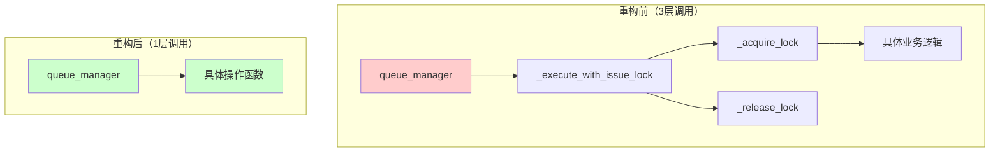
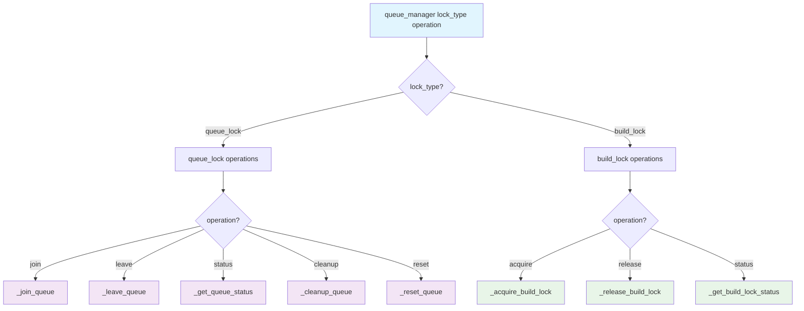
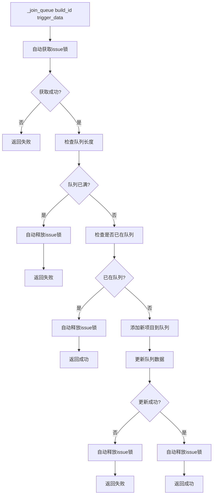
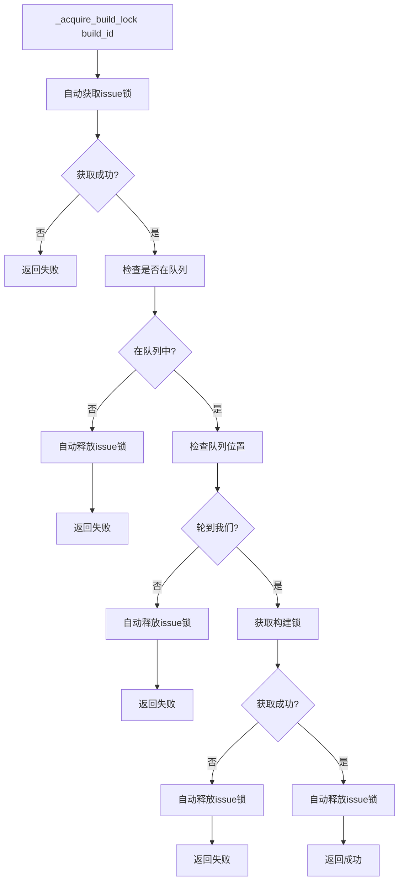
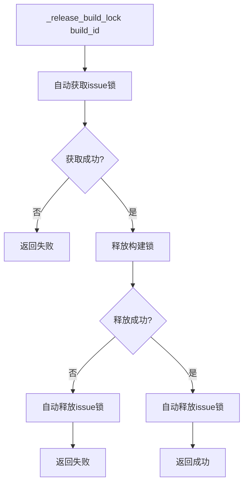

# Queue-Manager 重构设计文档

## 1. 设计目标

简化queue-manager的架构，减少函数层级，提高代码可读性和维护性。

## 2. 核心原则

- **单一职责**：每个函数只负责一个具体操作
- **自动锁管理**：操作函数内部自动处理锁的获取和释放
- **直接调用**：主调度函数直接调用具体操作函数

## 3. 架构设计

### 3.1 函数层次结构

```
queue_manager()                    # 主调度函数
    ↓
具体操作函数                        # 直接处理业务逻辑和锁管理
```

### 3.2 函数分类

#### 队列操作函数（自动处理Issue锁）
- `_join_queue(build_id, trigger_data)` - 加入队列
- `_leave_queue(build_id)` - 离开队列
- `_get_queue_status(build_id)` - 获取队列状态
- `_cleanup_queue(build_id)` - 清理队列
- `_reset_queue(build_id)` - 重置队列

#### 构建锁操作函数（自动处理Issue锁）
- `_acquire_build_lock(build_id)` - 获取构建锁
- `_release_build_lock(build_id)` - 释放构建锁
- `_get_build_lock_status(build_id)` - 获取构建锁状态

#### 内部锁操作函数（仅内部使用）
- `_acquire_lock(lock_type, build_id)` - 获取指定类型的锁
- `_release_lock(lock_type, build_id)` - 释放指定类型的锁

## 4. 详细流程图

### 4.1 架构对比流程图



### 4.2 主调度流程图



> **说明**：所有操作函数内部都会自动处理Issue锁的获取和释放，无需外部干预。

### 4.3 队列操作流程图



### 4.4 构建锁操作流程图



### 4.5 锁释放流程图



## 5. 函数接口设计

### 5.1 主调度函数
```bash
queue_manager(lock_type, operation, ...)
# lock_type: "queue_lock" | "build_lock"
# operation: "join" | "leave" | "acquire" | "release" | "status" | "cleanup" | "reset"
```

### 5.2 内部锁操作函数
```bash
_acquire_lock(lock_type, build_id, timeout)
# lock_type: "issue" | "build"
# build_id: 构建ID
# timeout: 超时时间（可选）

_release_lock(lock_type, build_id, timeout)
# lock_type: "issue" | "build"
# build_id: 构建ID
# timeout: 超时时间（可选）
```

### 5.3 队列操作函数（自动处理Issue锁）
```bash
_join_queue(build_id, trigger_data)
_leave_queue(build_id)
_get_queue_status(build_id)
_cleanup_queue(build_id)
_reset_queue(build_id)
```

### 5.4 构建锁操作函数（自动处理Issue锁）
```bash
_acquire_build_lock(build_id)
_release_build_lock(build_id)
_get_build_lock_status(build_id)
```

## 6. 调用示例

### 6.1 队列管理
```bash
# 加入队列
queue_manager "queue_lock" "join" "$trigger_data"

# 离开队列
queue_manager "queue_lock" "leave"

# 获取状态
queue_manager "queue_lock" "status"

# 清理队列
queue_manager "queue_lock" "cleanup"

# 重置队列
queue_manager "queue_lock" "reset"
```

### 6.2 构建锁管理
```bash
# 获取构建锁
queue_manager "build_lock" "acquire"

# 释放构建锁
queue_manager "build_lock" "release"

# 获取构建锁状态
queue_manager "build_lock" "status"
```

## 7. 优势分析

### 7.1 代码简化
- **函数数量减少**：从多个包装函数简化为直接操作函数
- **调用层次减少**：从3层调用简化为1层调用
- **逻辑更直观**：每个函数内部自动处理锁管理

### 7.2 维护性提升
- **职责明确**：每个函数只负责一个具体操作
- **错误处理统一**：锁的获取和释放在函数内部处理
- **日志记录清晰**：每个操作都有明确的日志标识

### 7.3 扩展性增强
- **新增操作简单**：只需要添加对应的操作函数
- **锁类型扩展**：可以轻松添加新的锁类型
- **操作类型扩展**：可以轻松添加新的操作类型
- **调用方式统一**：所有操作都通过 `queue_manager(lock_type, operation, ...)` 调用

## 8. 实施计划

1. **第一阶段**：重构队列操作函数（内部自动处理Issue锁）
2. **第二阶段**：重构构建锁操作函数（内部自动处理Issue锁）
3. **第三阶段**：重构主调度函数（直接调用操作函数）
4. **第四阶段**：测试和验证

## 9. 当前问题分析

### 9.1 现有架构问题
- 函数层级过多：`queue_manager` → `_execute_with_issue_lock` → `_acquire_lock` → 具体操作
- 包装函数冗余：`_execute_with_issue_lock` 和 `_execute_with_nested_locks` 功能重复
- 锁管理分散：锁的获取和释放逻辑分散在多个函数中

### 9.2 重构目标
- 简化函数层级：`queue_manager` → 具体操作函数（直接调用）
- 统一锁管理：每个操作函数内部自动处理锁
- 提高可读性：减少函数调用链，逻辑更直观

## 10. 风险评估

### 10.1 重构风险
- **功能影响**：确保重构后功能完全一致
- **性能影响**：保持原有的锁竞争处理机制
- **兼容性**：保持对外接口不变

### 10.2 缓解措施
- **分阶段实施**：逐步重构，每阶段充分测试
- **功能测试**：确保所有操作场景都正常工作
- **性能测试**：验证锁竞争处理性能

## 11. 代码示例

### 11.1 重构后的队列操作函数示例
```bash
_join_queue() {
  local build_id="$1"
  local trigger_data="$2"
  
  # 获取issue锁
  if ! _acquire_lock "issue" "$build_id"; then
    debug "error" "Failed to acquire issue lock for join queue"
    return 1
  fi
  
  # 执行队列操作
  _load_queue_data
  local queue_length=$(echo "$QUEUE_DATA" | jq '.queue | length // 0')
  
  if [ "$queue_length" -ge "$QUEUE_LIMIT" ]; then
    debug "error" "Queue is full ($queue_length/$QUEUE_LIMIT)"
    _release_lock "issue" "$build_id"
    return 1
  fi
  
  # ... 其他队列操作逻辑 ...
  
  # 释放issue锁
  _release_lock "issue" "$build_id"
  return 0
}
```

### 11.2 重构后的构建锁操作函数示例
```bash
_acquire_build_lock() {
  local build_id="$1"
  
  # 获取issue锁
  if ! _acquire_lock "issue" "$build_id"; then
    debug "error" "Failed to acquire issue lock for build lock acquisition"
    return 1
  fi
  
  # 检查队列位置
  _load_queue_data
  local current_build=$(echo "$QUEUE_DATA" | jq -r '.build_locked_by // null')
  local queue_position=$(echo "$QUEUE_DATA" | jq --arg run_id "$build_id" '.queue | map(.run_id) | index($run_id) // -1')
  
  if [ "$current_build" = "null" ] && [ "$queue_position" -eq 0 ]; then
    # 获取构建锁
    if _acquire_lock "build" "$build_id"; then
      debug "success" "Successfully acquired build lock"
      _release_lock "issue" "$build_id"
      return 0
    else
      debug "error" "Failed to acquire build lock"
      _release_lock "issue" "$build_id"
      return 1
    fi
  else
    debug "log" "Not our turn: current=$current_build, position=$queue_position"
    _release_lock "issue" "$build_id"
    return 1
  fi
}
```

## 12. 总结

通过这次重构，我们将实现：
- **极简架构**：`queue_manager` → 具体操作函数（1层调用）
- **自动锁管理**：每个操作函数内部自动处理锁的获取和释放
- **统一接口**：所有操作都通过 `queue_manager(lock_type, operation, ...)` 调用
- **清晰职责**：每个函数只负责一个具体操作
- **易于维护**：减少函数层级，提高代码可读性

重构后的queue-manager将更加高效、可靠和易于维护。 