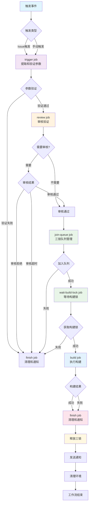
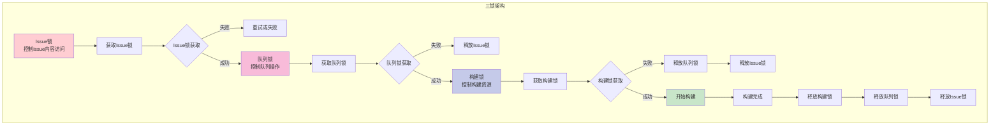
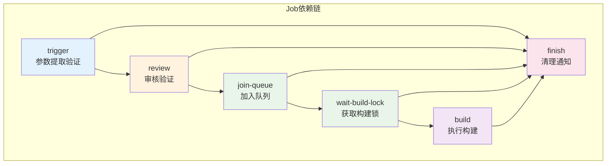
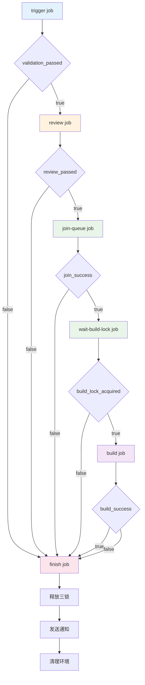
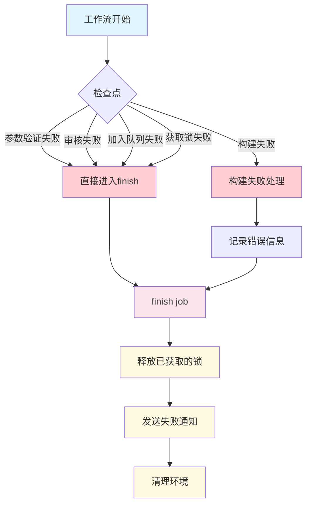
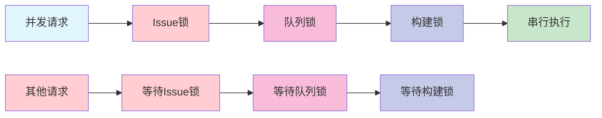

# Custom Rustdesk Build Workflow - 三锁架构流程图

## 工作流概览

## 三锁架构详细流程

## Job依赖关系图

## 条件执行逻辑

## 错误处理流程

## 关键特性说明

### 1. 三锁架构
- **Issue锁**: 控制对GitHub Issue内容的访问，防止并发更新
- **队列锁**: 控制对构建队列的操作，确保队列操作的原子性
- **构建锁**: 确保同一时间只有一个构建进程运行

### 2. 条件执行
- 每个job都有明确的前置条件
- 失败时立即跳转到finish job进行清理
- 使用`always()`确保finish job总是执行

### 3. 错误处理
- 每个步骤都有错误检查
- 失败时自动释放已获取的锁
- 发送适当的通知和错误信息

### 4. 资源管理
- 自动清理构建环境
- 释放所有获取的锁
- 发送构建结果通知

## 工作流状态转换

| 状态 | 触发条件 | 执行动作 | 下一状态 |
|------|----------|----------|----------|
| 参数验证 | 工作流触发 | 提取和验证参数 | 审核验证/失败处理 |
| 审核验证 | 参数验证通过 | 检查是否需要审核 | 队列管理/失败处理 |
| 队列管理 | 审核通过 | 获取三锁并加入队列 | 构建锁等待/失败处理 |
| 构建锁等待 | 成功加入队列 | 等待获取构建锁 | 构建执行/失败处理 |
| 构建执行 | 获取构建锁 | 执行构建过程 | 完成处理 |
| 完成处理 | 构建完成/失败 | 清理和通知 | 工作流结束 |

## 并发控制机制

这个三锁架构确保了：
1. **数据一致性**: Issue锁防止并发更新
2. **队列安全**: 队列锁确保队列操作的原子性
3. **资源独占**: 构建锁确保构建资源的独占使用
4. **错误恢复**: 自动释放锁和清理资源 