# Custom RustDesk 构建工作流 - 各步骤流程图

## 整体工作流概览

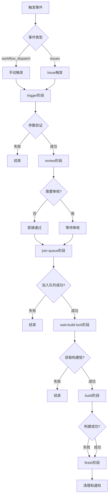

## 1. Trigger阶段流程

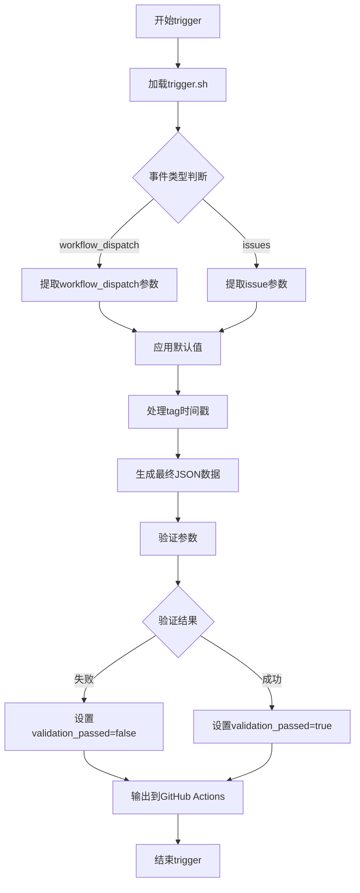

### Trigger阶段详细操作

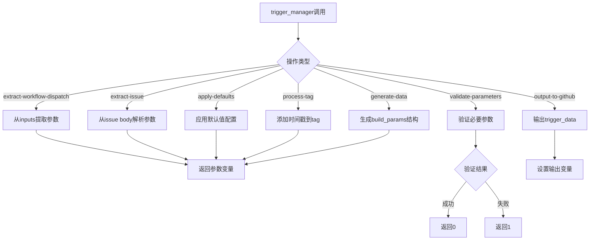

## 2. Review阶段流程

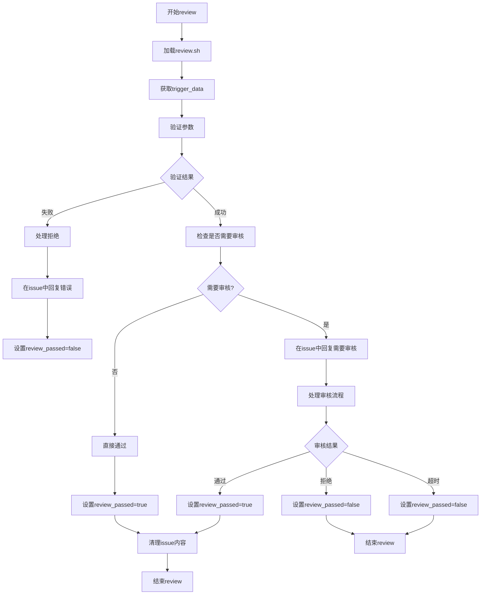

### Review阶段详细操作

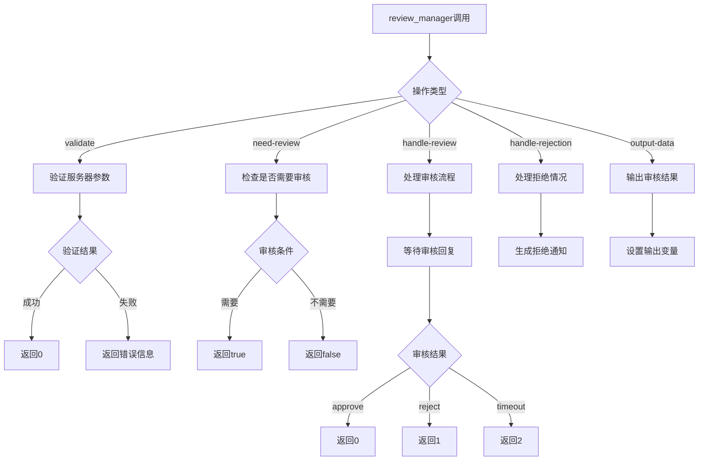

## 3. Join-Queue阶段流程

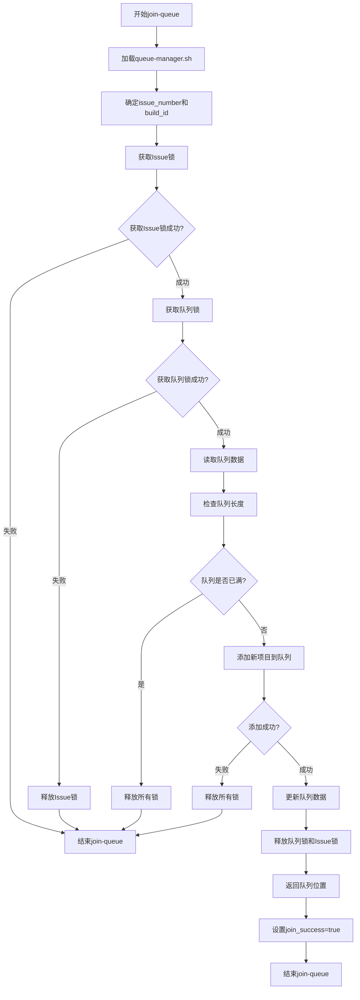

### Queue Manager详细操作

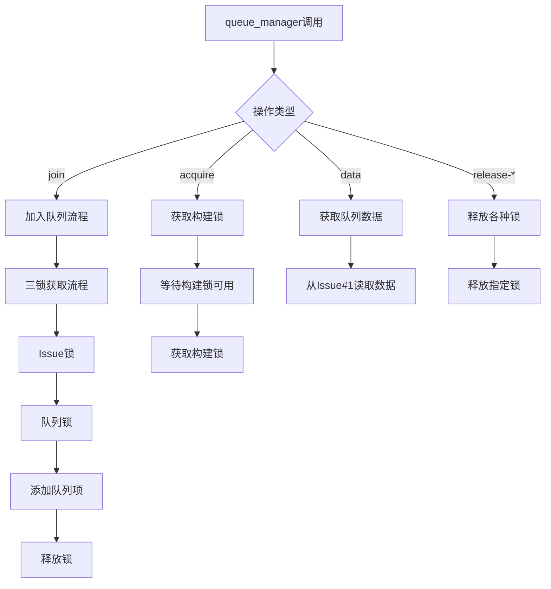

## 4. Wait-Build-Lock阶段流程

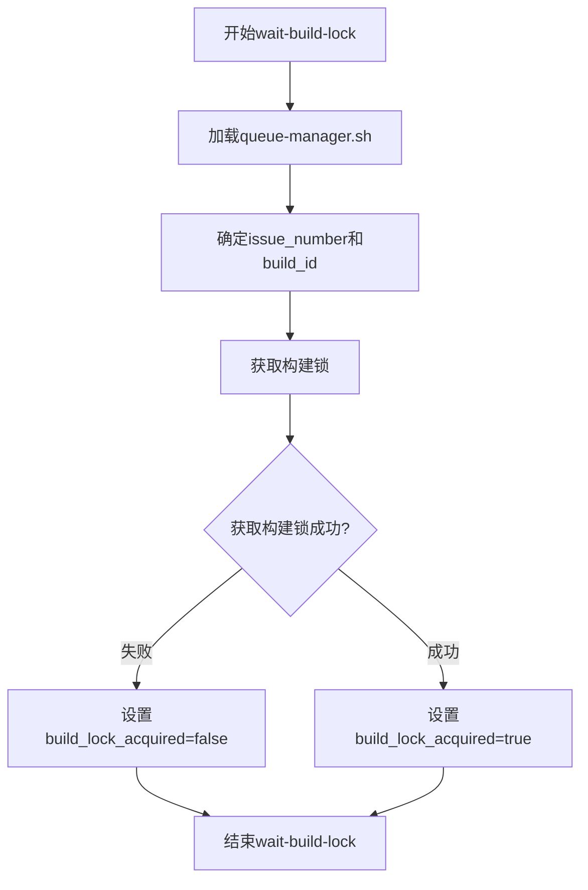

## 5. Build阶段流程

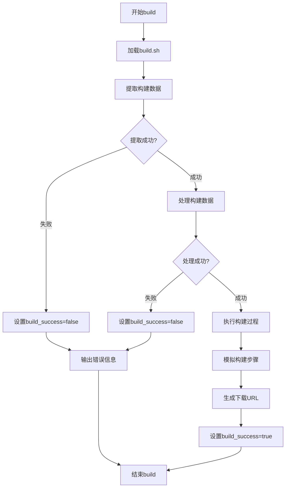

### Build阶段详细操作

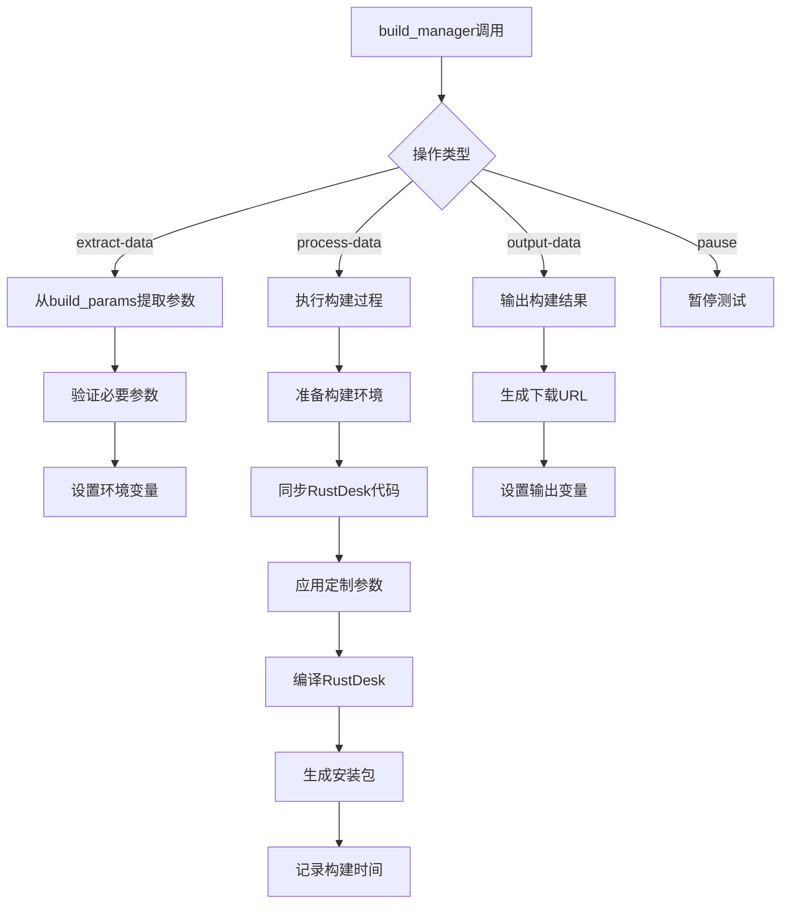

## 6. Finish阶段流程

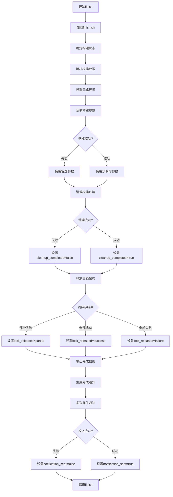

### Finish阶段详细操作

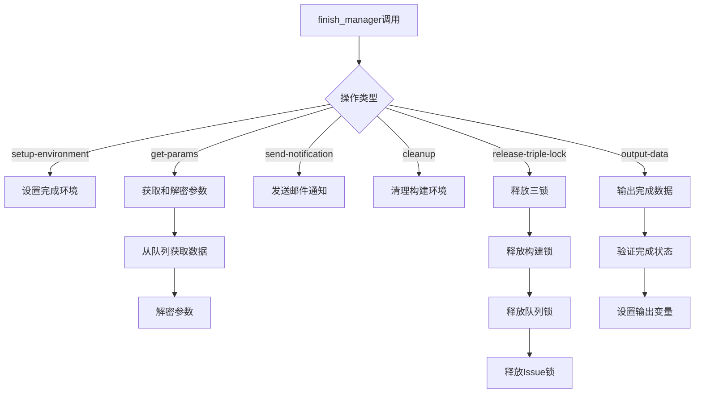

## 数据流图

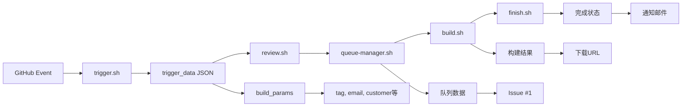

## 锁管理流程

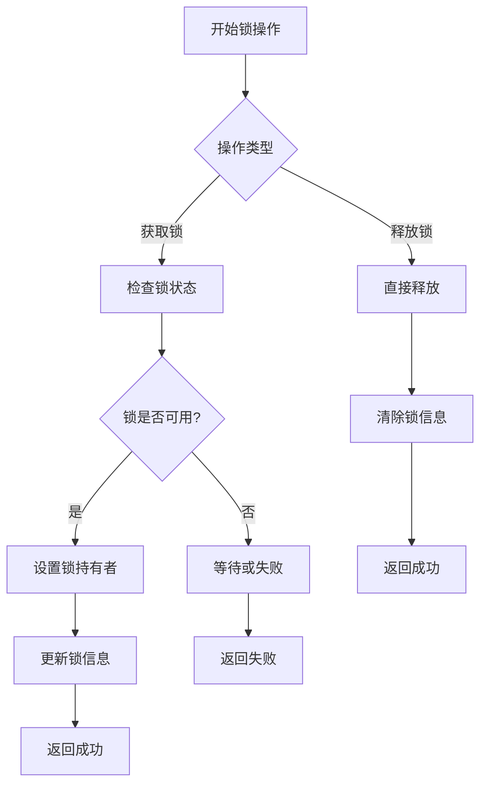

## 错误处理流程

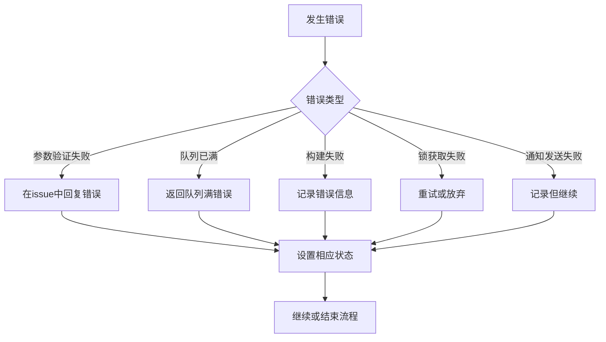

## 关键决策点

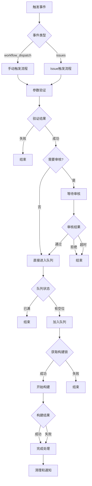

这些流程图展示了整个Custom RustDesk构建工作流的详细运作方式，包括每个阶段的决策点、错误处理和状态转换。 